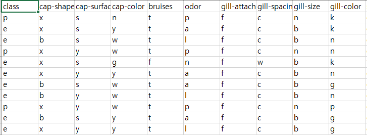
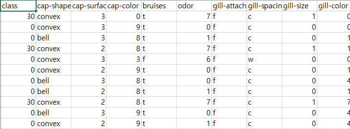
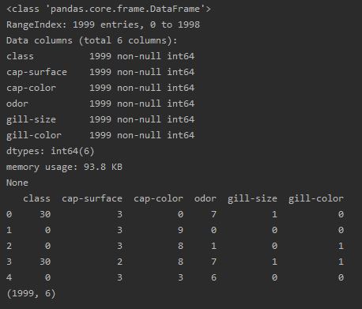
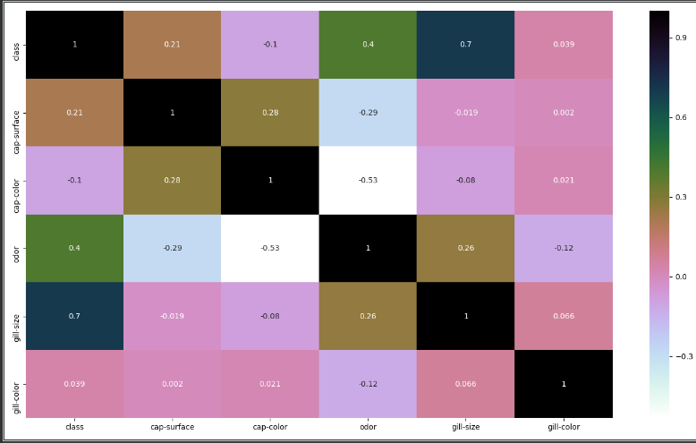
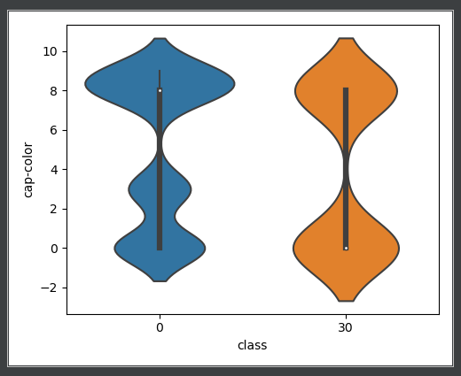
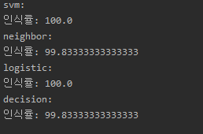

# 식용버섯인지 독버섯인지 분류하기

### 버섯 데이터셋 출처 및 참고 사이트

https://www.kaggle.com/uciml/mushroom-classification


## 순번

#### 1. 데이터 전처리

#### 2. 데이터 읽기 뒤 불필요한 열 삭제

#### 3. 데이터분석

#### 4.여러가지 도구들로 학습시킨뒤에 예측


### 1. 데이터 전처리






(0은 독이없는 버섯, 30은 독이 있는 버섯이라는 걸 나타내었고 나머지 값들을 서로 구분짓는 숫자로 나타내었음)

### 2. 데이터 읽기 뒤 불필요한 열 삭제

```python
from classification_util import ClassificationUtil
busot=ClassificationUtil()
busot.ignore_warning()
busot.read('mushrooms.csv')
busot.drop(['cap-shape','bruises','gill-attachment','gill-spacing','stalk-shape','stalk-root','stalk-surface-above-ring','stalk-color-above-ring','stalk-surface-below-ring','stalk-color-below-ring','veil-type','veil-color','ring-number','ring-type','spore-print-color','population','habitat'])

```




(열을 제거한 뒤 모습)


### 3. 데이터분석

```python
busot.heatmap()
busot.myviolinplot('class','cap-color')
```







#### 4. 여러가지 도구들로 학습시킨뒤에 예측

```python
print('svm:')
busot.run_svm(['cap-color','cap-surface','odor','gill-size','gill-color'],'class')
print('neighbor:')
busot.run_neighbor_classifier(['cap-color','cap-surface','odor','gill-size','gill-color'],'class',3)
print('logistic:')
busot.run_logistic_regression(['cap-color','cap-surface','odor','gill-size','gill-color'],'class')
print('decision:')
busot.run_decision_tree_classifier(['cap-color','cap-surface','odor','gill-size','gill-color'],'class')
```




많은 표본수와 독버섯 특유의 odor(냄새)와 cap-color(갓색깔)이 식용 버섯들과 틀리기 때문에 높은 적중률을 보이게 되었습니다.